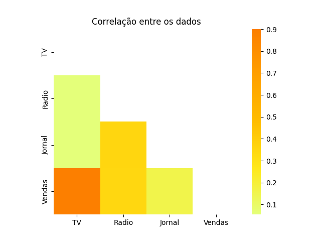
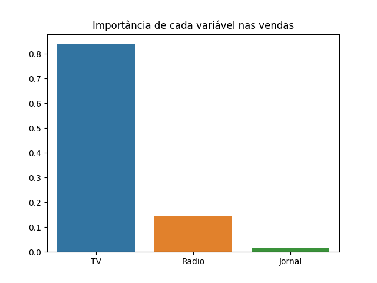
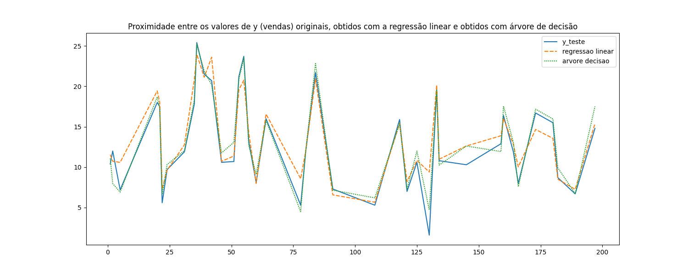

# Análise de dados com Python

Repositório com o intuito de estudar análise de dados utilizando bibliotecas do Python.

## Caso 1 - Correlação e predição de vendas

O desafio é conseguir prever as vendas de um determinado período com base nos gastos em anúncios nas 3 grandes redes que uma empresa fictícia investe: TV, jornal e rádio.

Num primeiro momento, observa-se a correlação entre a quantia em vendas e o investimento em anúncios para cada rede através de dados disponibilizados em uma base de dados. Num segundo momento, são realizadas predições de quantia em vendas para novos valores de investimentos em anúncios para cada rede através de uma nova base de dados. Utilizando os códigos escritos e disponibilizados no arquivo <a href='/cases/sell_prediction.ipynb'>sell_prediction.ipynb</a>, foram obtidos os seguintes gráficos:

  
  
  

<h2>Nestes projetos foram utilizadas as seguintes bibliotecas:</h2>

- Pandas
- Seaborn
- Numpy
- Matplotlib
- Scikit-learn
